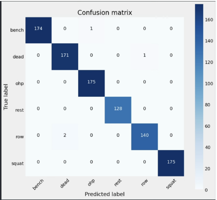
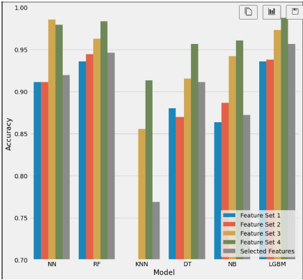
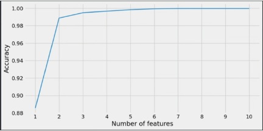
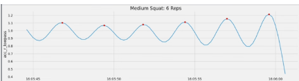

# Smart Workout Tracking with Machine Learning

Turn raw wearable sensor data (accelerometer + gyroscope) into **exercise classification** and **rep counting** in (near) real-time.

**Highlights**
- Classified **6 strength exercises** with **>99% accuracy** using SVM/LSTM/LightGBM.
- Engineered **statistical, temporal, and frequency** features; visualized clusters with **t-SNE**.
- **Adaptive peak detection** for robust rep counting (avg. error ≤ 1 rep).
- Designed for **low-latency inference** on wearables / phones.

---

## Project Structure


Smart-Workout-Tracking-ML/
├─ src/
├─ data/
│ ├─ raw/
│ ├─ interim/
│ └─ processed/
├─ results/
├─ environment.yml
├─ README.md
├─ .gitignore


---

## Setup

### Conda
### Pip (venv)
```bash
python -m venv .venv
. .venv/Scripts/activate   # Windows
pip install -U pip wheel

```

Results

## Results

- **Exercise classification**:
  - Random Forest achieved the highest test accuracy: **99.4%**
  - Neural Network ~99.3%, LightGBM ~98%
  - KNN and Naive Bayes underperformed, showing the value of rich feature engineering.

- **Confusion Matrix**:
  - Very few misclassifications, mainly between biomechanically similar lifts  
    (e.g., Bench Press vs. Overhead Press, Deadlift vs. Row).

- **Generalization**:
  - Leave-one-participant-out test still achieved **>99% accuracy**,  
    proving robustness to unseen users.

- **Repetition counting**:
  - Adaptive peak detection achieved **Mean Absolute Error (MAE) ≈ 1 rep** across 85 sets.  
  - Worked best on structured lifts (Squat, Deadlift), slightly noisier on Rows.

- **Feature selection**:
  - Top 10 frequency & temporal features provided most of the predictive power.  
  - Beyond ~3–4 features, gains diminished (helpful for real-time systems).

---


### Visual Examples

**Confusion Matrix**  


**Model Accuracy Comparison**  


**Feature Selection Curve**  


**Rep Counting Example**  


---


